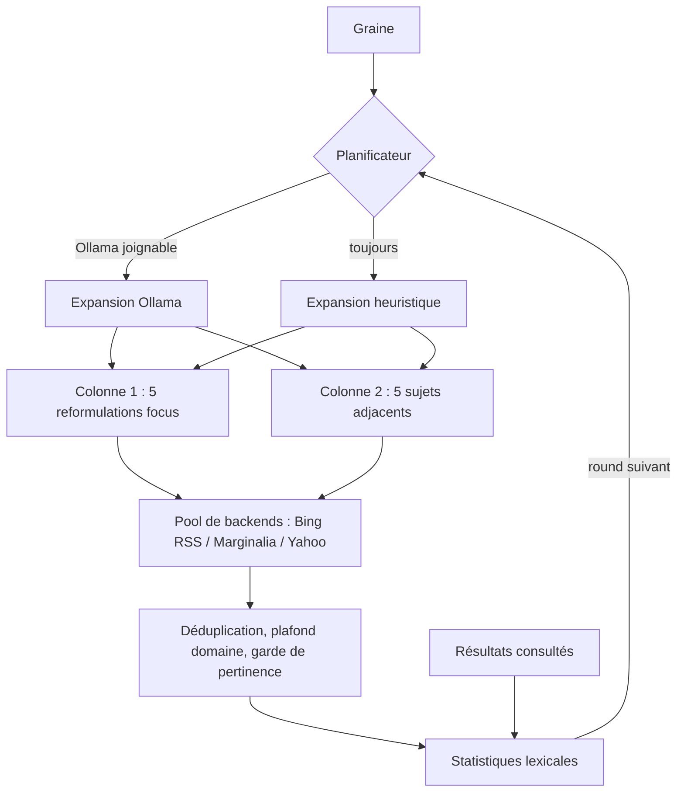

<div align="center">

# DendroPivot

**Une méthodologie innovante pour apprendre en profondeur : partir d’une requête, puis pivoter, ramifier et faire grandir un arbre de connaissance autour d’elle.**

DendroPivot transforme une recherche isolée en parcours d’apprentissage guidé. À chaque round, la requête graine se ramifie en cinq reformulations *focus* et cinq sujets *adjacents* ; ce que vous lisez renforce l’arbre, et n’importe quel résultat peut devenir la nouvelle racine. Fonctionne en terminal ou en arbre web local live, interroge plusieurs index gratuits sans clé API, peut utiliser un LLM local via [Ollama](https://ollama.com) et ne requiert que la bibliothèque standard Python.

[](https://www.python.org/downloads/)
[](LICENSE)
[](requirements.txt)
[](#backends-de-recherche)
[](#ollama)
[](#plateformes)
[](SECURITY.md)
[](CONTRIBUTING.md)

[](https://github.com/TFD-42/dendropivot-search/releases)
[](https://github.com/TFD-42/dendropivot-search/commits/main)
[](https://github.com/TFD-42/dendropivot-search/issues)
[](https://github.com/TFD-42/dendropivot-search/stargazers)

[English](README.md) · [Français](README.fr.md)

</div>

---

## Sommaire

- [Pourquoi DendroPivot](#pourquoi-dendropivot)
- [La méthode du pivot](#la-méthode-du-pivot)
- [Fonctionnalités](#fonctionnalités)
- [Fonctionnement](#fonctionnement)
- [Prérequis](#prérequis)
- [Installation](#installation)
- [Démarrage rapide](#démarrage-rapide)
- [Options](#options)
- [Raccourcis clavier](#raccourcis-clavier)
- [Vue web locale](#vue-web-locale)
- [Serveur distant via SSH](#serveur-distant-via-ssh)
- [Ollama](#ollama)
- [Sortie JSON](#sortie-json)
- [Variables d’environnement](#variables-denvironnement)
- [Backends de recherche](#backends-de-recherche)
- [Plateformes](#plateformes)
- [Sécurité](#sécurité)
- [Tests](#tests)
- [Structure](#structure)
- [Contribuer](#contribuer)
- [Licence](#licence)
- [Remerciements](#remerciements)

## Pourquoi DendroPivot

Une requête isolée ne montre qu’un angle du sujet. DendroPivot (`websearch.py`) traite la requête comme une **graine** : il la décline en cinq reformulations et cinq sujets connexes, les interroge sur plusieurs index gratuits et utilise les résultats que vous ouvrez pour orienter le round suivant. On obtient un arbre d’exploration plutôt qu’une liste plate, en terminal, en JSON, en snapshot HTML ou en vue web locale live.

## La méthode du pivot

Apprendre un sujet en profondeur, c’est alterner entre *ce que c’est*, *comment on l’utilise*, *à quoi on le compare*, *ce qui a changé récemment* et *comment il fonctionne*, puis suivre les pistes qu’on ignorait. DendroPivot rend cette boucle explicite :

| Étape | Ce qui se passe | Pourquoi ça aide à apprendre |
|---|---|---|
| 1. **Graine** | Vous saisissez une requête initiale. | Pose la racine de l’arbre. |
| 2. **Ramification** | Elle se décline en 5 angles focus (définition, pratique, comparaison, actualité, technique) et 5 sujets adjacents. | Couvre le sujet sous plusieurs perspectives au lieu d’un seul classement. |
| 3. **Lecture** | Ouvrir un résultat renforce son vocabulaire dans le champ lexical. | Votre curiosité oriente le round suivant, pas un classement générique. |
| 4. **Croissance** | Chaque round ancre les requêtes sur les termes partagés entre résultats. | Fait émerger les concepts centraux et le jargon du domaine. |
| 5. **Pivot** | `f` (ou Maj + clic) fait d’un résultat la nouvelle racine. | Plonge dans un sous-sujet sans perdre le contexte. |
| 6. **Retour** | L’historique conserve chaque arbre ; `b` / `n` naviguent arrière/avant. | Comparez les branches et revenez au fil principal à tout moment. |

Le résultat est une carte du domaine construite à partir de votre propre parcours de lecture, exportable en JSON ou HTML.

## Fonctionnalités

- **Deux colonnes par round**
  - **Focus** : la graine reformulée selon cinq angles (définition, pratique, comparaison, actualité, technique).
  - **Adjacent** : sujets connexes dérivés du champ lexical des résultats (bigrammes, co-occurrences) ou proposés par un modèle local.
- **Enrichissement continu** : chaque résultat consulté renforce ses termes ; `f` pivote la graine sur le résultat sélectionné.
- **Recherche multi-backends** : rotation, fallback, cooldown après échec, déduplication, plafond par domaine, filtrage des dictionnaires.
- **Quatre modes de sortie** : TUI interactive, JSON (`--json`), snapshot HTML (`--html-out`), vue web locale (`--web`, `--web-only`).
- **Historique de navigation** : chaque pivot ou nouvelle graine archive l’état complet, restaurable en arrière/avant.
- **Ollama optionnel** : expansion de requêtes et traduction à la demande de l’interface web (FR, EN, ES, IT, ZH, RU).
- **Bibliothèque standard Python uniquement** : aucun `pip install`, y compris sur Android via Termux.
- **Sécurité locale par défaut** : serveur en boucle locale uniquement, lectures réseau et POST bornés, URL HTTP(S) strictes, aucun shell construit depuis une entrée utilisateur.

## Fonctionnement



Chaque round planifie une dizaine de requêtes, les exécute avec un délai de politesse, fusionne et filtre les résultats, puis attend le round suivant (60 s par défaut).

## Prérequis

| Composant | Exigence |
|---|---|
| Python | **3.10 ou plus récent** |
| Réseau | HTTPS sortant vers les backends |
| Ollama | Optionnel, pour l’expansion LLM et la traduction |
| Paquets Python | Aucun |

## Installation

```bash
git clone https://github.com/TFD-42/dendropivot-search.git
cd dendropivot-search
python3 -m py_compile websearch.py
```

Sur Termux :

```bash
pkg install python git
git clone https://github.com/TFD-42/dendropivot-search.git
cd dendropivot-search
```

## Démarrage rapide

Session interactive :

```bash
python3 websearch.py -q "modèles de langage" --no-ollama
```

Un round en JSON :

```bash
python3 websearch.py \
  -q "modèles de langage" \
  --rounds 1 \
  --no-ollama \
  --json > resultats.json
```

Snapshot HTML :

```bash
python3 websearch.py \
  -q "modèles de langage" \
  --rounds 1 \
  --no-ollama \
  --html-out resultat.html
```

Vue web locale sans TUI :

```bash
python3 websearch.py \
  -q "modèles de langage" \
  --web-only \
  --no-ollama
# ouvrir http://127.0.0.1:8765/
```

## Options

| Option | Défaut | Description |
|---|---|---|
| `-q`, `--query TEXTE` | prompt | Graine initiale |
| `-n`, `--limit N` | `6` | Résultats max par requête (`>= 1`) |
| `--interval SECONDES` | `60` | Délai entre rounds (`>= 1`) |
| `--delay SECONDES` | `1.5` | Délai entre requêtes HTTP (`>= 0`) |
| `--rounds N` | `0` | Nombre de rounds ; `0` = illimité en interactif, `1` hors TTY |
| `--no-ollama` | non | Expansion heuristique seule |
| `--ollama-model NOM` | `$OLLAMA_MODEL` ou premier listé | Modèle Ollama |
| `--no-color` | non | Sans couleurs ANSI (respecte aussi `NO_COLOR`) |
| `--json` | non | Sortie JSON en mode non interactif |
| `--log-file CHEMIN` | `$WEBSEARCH_LOG` | Fichier de log |
| `--web [PORT]` | `8765` | Vue arbre live sur `http://127.0.0.1:PORT/` |
| `--web-host HÔTE` | `127.0.0.1` | Interface d’écoute ; seuls `127.0.0.1`, `localhost`, `::1` sont acceptés |
| `--web-only` | non | Serveur web + rounds sans TUI jusqu’à Ctrl-C (requiert `-q`) |
| `--html-out CHEMIN` | aucun | Réécrit un snapshot HTML après chaque round |
| `--no-web-ssh-hint` | non | Masque les instructions de tunnel SSH |
| `--debug` | non | Logs de debug |

`python3 websearch.py --help` fait foi.

## Raccourcis clavier

| Touche | Action |
|---|---|
| `↑` / `↓` ou chiffres | Sélection |
| `←` / `→` ou `Tab` | Changer de colonne |
| `Entrée` | Détail du résultat |
| `o` | Ouvrir dans le navigateur |
| `f` | Pivot : le résultat devient la graine |
| `b` / `n` | Historique arrière / avant |
| `r` | Round immédiat |
| `p` | Pause / reprise |
| `l` | Journal |
| `w` | Ouvrir la vue web (si active) |
| `q` | Retour au prompt |
| `Ctrl-C` | Quitter |

Sous 90 colonnes (Termux portrait), les colonnes sont empilées.

## Vue web locale

`--web` ou `--web-only` sert un arbre auto-actualisé : graine en tête, groupes focus/adjacent, une carte colorée par requête dépliable sur ses résultats, vue historique complète par round, fil d’Ariane et sélecteur de traduction LLM.

| Action | Effet |
|---|---|
| Clic sur une carte | Déplier / replier |
| Clic sur un résultat | Ouvre le lien et le marque consulté |
| Maj + clic | Pivote la graine sur ce résultat |

Endpoints (boucle locale) : `GET /`, `GET /state.json`, `POST /api/{viewed,pivot,round,back,forward,goto,pause,seed,translate}` (JSON).

## Serveur distant via SSH

Le serveur n’écoute jamais sur une interface non locale. Depuis une autre machine :

```bash
ssh -L 8765:127.0.0.1:8765 utilisateur@serveur
```

Si une session SSH est détectée (`SSH_CONNECTION`), la commande de tunnel exacte est affichée au démarrage et journalisée (`l`).

## Ollama

Si [Ollama](https://github.com/ollama/ollama) répond sur `http://127.0.0.1:11434`, il est détecté et utilisé pour l’expansion. En cas d’échec, l’expansion heuristique prend le relais.

```bash
python3 websearch.py -q "modèles de langage" --rounds 1
python3 websearch.py -q "modèles de langage" --ollama-model llama3.2
```

`--no-ollama` donne un fonctionnement déterministe. La traduction dans la vue web reste disponible à la demande si Ollama est joignable : `--no-ollama` ne désactive que l’expansion.

## Sortie JSON

```json
{
  "seed": "modèles de langage",
  "rounds": 1,
  "columns": {
    "1": [
      {
        "query": "modèles de langage",
        "method": "seed",
        "round": 1,
        "results": [
          { "title": "…", "url": "https://…", "snippet": "…", "backend": "bing-rss" }
        ]
      }
    ],
    "2": []
  },
  "lexical_field": ["…"]
}
```

## Variables d’environnement

| Variable | Rôle |
|---|---|
| `OLLAMA_HOST` | URL d’Ollama (défaut `http://127.0.0.1:11434`) |
| `OLLAMA_MODEL` | Modèle Ollama préféré |
| `WEBSEARCH_LOG` | Fichier de log par défaut |
| `NO_COLOR` | Désactive les couleurs ([no-color.org](https://no-color.org/)) |

## Backends de recherche

| Backend | Endpoint | Notes |
|---|---|---|
| `bing-rss` | `bing.com/search?format=rss` | RSS structuré, premier choix pour le focus |
| `marginalia` | [`old-search.marginalia.nu`](https://old-search.marginalia.nu/) | Index indépendant ; interstitiel anti-bot suivi automatiquement |
| `yahoo` | `search.yahoo.com` | Parsing HTML best-effort |

Rotation pour les requêtes adjacentes, cooldown de 180 s après échec. Les backends HTML dépendent du balisage tiers et peuvent casser sans préavis : signalez-le via le [modèle de bug](.github/ISSUE_TEMPLATE/bug_report.yml). Respectez les conditions d’utilisation de chaque moteur.

## Plateformes

| Plateforme | TUI | Ouverture des liens |
|---|---|---|
| Linux | Oui | `xdg-open` |
| macOS | Oui | `open` |
| Windows (Terminal, PowerShell, cmd) | Oui | `os.startfile` |
| Android via [Termux](https://termux.dev/) | Oui | `termux-open-url` |

## Sécurité

Le serveur HTTP intégré est conçu pour un **usage local mono-utilisateur** :

- écoute en boucle locale uniquement ; `--web-host` non local refusé ;
- réponses réseau limitées à 5 Mio, corps POST JSON à 64 Kio ;
- graines limitées à 200 caractères, historique à 50 états ;
- URL de résultats limitées à `http://` et `https://` ;
- en-têtes `nosniff`, `no-referrer`, `no-store` ;
- aucun `shell=True`, aucun appel shell construit depuis une entrée utilisateur.

Ne l’exposez pas derrière un reverse proxy public sans authentification, HTTPS et protection CSRF. Signalement privé : [SECURITY.md](SECURITY.md).

## Tests

```bash
python3 -m unittest discover -s tests -v
python3 -m py_compile websearch.py
```

## Structure

```text
dendropivot-search/
├── websearch.py              # application mono-fichier
├── tests/
│   └── test_websearch.py     # tests unitaires hors réseau
├── .github/
│   ├── ISSUE_TEMPLATE/       # bug, fonctionnalité, config
│   ├── PULL_REQUEST_TEMPLATE.md
│   └── CODEOWNERS
├── README.md / README.fr.md
├── CHANGELOG.md
├── CONTRIBUTING.md
├── CODE_OF_CONDUCT.md
├── SECURITY.md
├── SUPPORT.md
├── CITATION.cff
├── LICENSE
└── requirements.txt          # volontairement vide : stdlib uniquement
```

## Contribuer

Lisez [CONTRIBUTING.md](CONTRIBUTING.md) et le [Code de conduite](CODE_OF_CONDUCT.md), puis ouvrez une [issue](https://github.com/TFD-42/dendropivot-search/issues/new/choose) ou une pull request. Aide : [SUPPORT.md](SUPPORT.md).

## Licence

[MIT](LICENSE).

## Remerciements

- [Ollama](https://ollama.com) pour l’exécution locale de modèles.
- [Marginalia Search](https://old-search.marginalia.nu/) pour un index web indépendant et non commercial.
- [Shields.io](https://shields.io) pour les badges.
- [Keep a Changelog](https://keepachangelog.com/fr/1.1.0/) et [Semantic Versioning](https://semver.org/lang/fr/) pour les conventions de release.

<div align="center">

Maintenu par [@TFD-42](https://github.com/TFD-42) · [Signaler un bug](https://github.com/TFD-42/dendropivot-search/issues/new?template=bug_report.yml) · [Proposer une fonctionnalité](https://github.com/TFD-42/dendropivot-search/issues/new?template=feature_request.yml)

</div>
