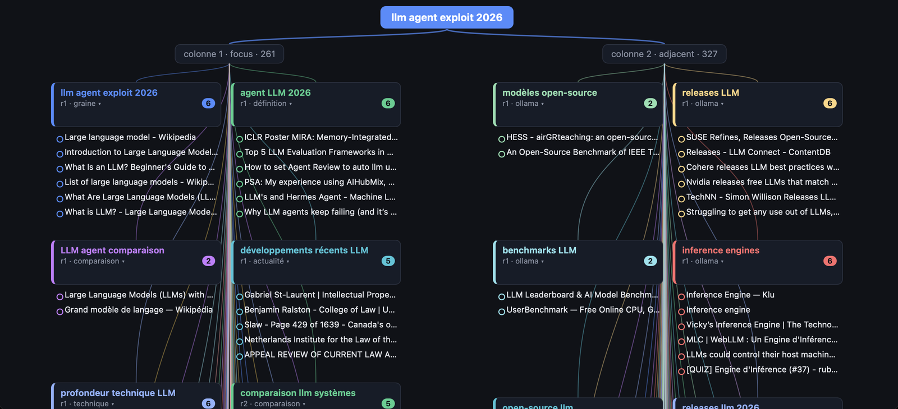
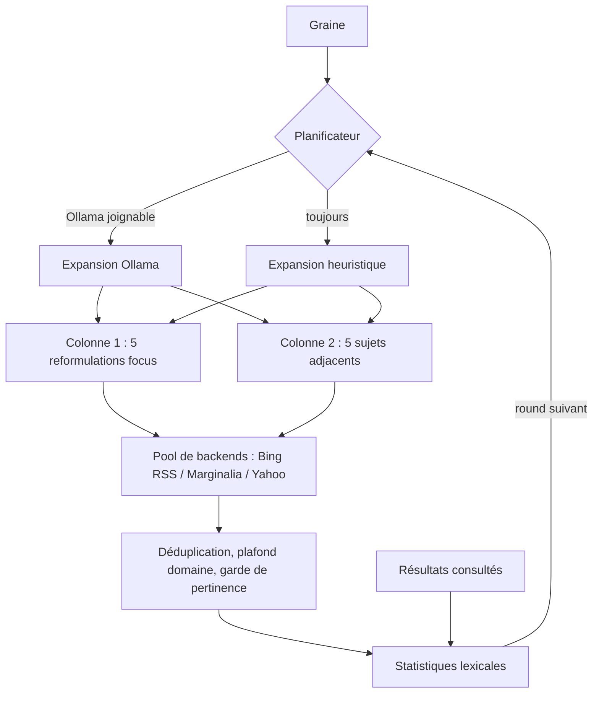
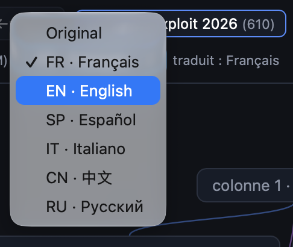

<div align="center">

# DendroPivot

### Explorateur de recherche web par pivots : faire pousser un arbre de connaissance à partir d’une requête

**Une méthodologie innovante pour apprendre en profondeur : partir d’une requête, puis pivoter, ramifier et faire grandir un arbre de connaissance autour d’elle.**

DendroPivot transforme une recherche isolée en parcours d’apprentissage guidé. À chaque round, la requête graine se ramifie en cinq reformulations *focus* et cinq sujets *adjacents* ; ce que vous lisez renforce l’arbre, et n’importe quel résultat peut devenir la nouvelle racine. Fonctionne en terminal ou en arbre web local live, interroge plusieurs index gratuits sans clé API, peut utiliser un LLM local via [Ollama](https://ollama.com) et ne requiert que la bibliothèque standard Python.

[](https://www.python.org/downloads/)
[](LICENSE)
[](requirements.txt)
[](#backends-de-recherche)
[](#ollama)
[](#plateformes)
[](SECURITY.md)
[](CONTRIBUTING.md)

[](https://github.com/TFD-42/dendropivot-search/releases)
[](https://github.com/TFD-42/dendropivot-search/commits/main)
[](https://github.com/TFD-42/dendropivot-search/issues)
[](https://github.com/TFD-42/dendropivot-search/stargazers)

[English](README.md) · [Français](README.fr.md)

</div>

<p align="center">
  
</p>

<p align="center"><em>Arbre HTML live : la graine à la racine, les reformulations focus (gauche) et les sujets adjacents (droite), chaque carte dépliée sur ses résultats.</em></p>

---

## Sommaire

- [Pourquoi DendroPivot](#pourquoi-dendropivot)
- [La méthode du pivot](#la-méthode-du-pivot)
- [Fonctionnalités](#fonctionnalités)
- [Fonctionnement](#fonctionnement)
- [Prérequis](#prérequis)
- [Installation](#installation)
- [Lanceur](#lanceur)
- [Démarrage rapide](#démarrage-rapide)
- [Modes de sortie](#modes-de-sortie)
- [Options](#options)
- [Raccourcis clavier](#raccourcis-clavier)
- [Vue web locale](#vue-web-locale)
- [Serveur distant via SSH](#serveur-distant-via-ssh)
- [Ollama](#ollama)
- [Sortie JSON](#sortie-json)
- [Variables d’environnement](#variables-denvironnement)
- [Backends de recherche](#backends-de-recherche)
- [Plateformes](#plateformes)
- [Sécurité](#sécurité)
- [Tests](#tests)
- [Structure](#structure)
- [Contribuer](#contribuer)
- [Licence](#licence)
- [Remerciements](#remerciements)

## Pourquoi DendroPivot

Une requête isolée ne montre qu’un angle du sujet. DendroPivot (`websearch.py`) traite la requête comme une **graine** : il la décline en cinq reformulations et cinq sujets connexes, les interroge sur plusieurs index gratuits et utilise les résultats que vous ouvrez pour orienter le round suivant. On obtient un arbre d’exploration plutôt qu’une liste plate, en terminal, en JSON, en snapshot HTML ou en vue web locale live.

## La méthode du pivot

Apprendre un sujet en profondeur, c’est alterner entre *ce que c’est*, *comment on l’utilise*, *à quoi on le compare*, *ce qui a changé récemment* et *comment il fonctionne*, puis suivre les pistes qu’on ignorait. DendroPivot rend cette boucle explicite :

| Étape | Ce qui se passe | Pourquoi ça aide à apprendre |
|---|---|---|
| 1. **Graine** | Vous saisissez une requête initiale. | Pose la racine de l’arbre. |
| 2. **Ramification** | Elle se décline en 5 angles focus (définition, pratique, comparaison, actualité, technique) et 5 sujets adjacents. | Couvre le sujet sous plusieurs perspectives au lieu d’un seul classement. |
| 3. **Lecture** | Ouvrir un résultat renforce son vocabulaire dans le champ lexical. | Votre curiosité oriente le round suivant, pas un classement générique. |
| 4. **Croissance** | Chaque round ancre les requêtes sur les termes partagés entre résultats. | Fait émerger les concepts centraux et le jargon du domaine. |
| 5. **Pivot** | `f` (ou Maj + clic) fait d’un résultat la nouvelle racine. | Plonge dans un sous-sujet sans perdre le contexte. |
| 6. **Retour** | L’historique conserve chaque arbre ; `b` / `n` naviguent arrière/avant. | Comparez les branches et revenez au fil principal à tout moment. |

Le résultat est une carte du domaine construite à partir de votre propre parcours de lecture, exportable en JSON ou HTML.

## Fonctionnalités

- **Deux colonnes par round**
  - **Focus** : la graine reformulée selon cinq angles (définition, pratique, comparaison, actualité, technique).
  - **Adjacent** : sujets connexes dérivés du champ lexical des résultats (bigrammes, co-occurrences) ou proposés par un modèle local.
- **Enrichissement continu** : chaque résultat consulté renforce ses termes ; `f` pivote la graine sur le résultat sélectionné.
- **Recherche multi-backends** : rotation, fallback, cooldown après échec, déduplication, plafond par domaine, filtrage des dictionnaires.
- **HTML d’abord** : un lancement simple ouvre un arbre live dans le navigateur ; hors terminal, un snapshot HTML autonome est écrit. Interface terminal (`--tui`), JSON (`--json`) et texte (`--text`) restent disponibles.
- **Lanceur** : un menu pour installer Ollama et un modèle, choisir la langue, lancer une requête ou quitter (`run.sh`, `run.bat`, `launcher.py`).
- **Six langues** (`--lang fr|en|es|it|zh|ru`) : gabarits de recherche, expansion LLM et interface ; interfaces française et anglaise disponibles hors ligne.
- **Historique de navigation** : chaque pivot ou nouvelle graine archive l’état complet, restaurable en arrière/avant.
- **Ollama optionnel** : expansion de requêtes et traduction à la demande de l’interface web (FR, EN, ES, IT, ZH, RU).
- **Bibliothèque standard Python uniquement** : aucun `pip install`, y compris sur Android via Termux.
- **Sécurité locale par défaut** : serveur en boucle locale avec contrôle Host et Origin (protection DNS rebinding et CSRF), CSP stricte, lectures réseau et POST bornés, URL HTTP(S) strictes, aucun shell construit depuis une entrée utilisateur.

## Fonctionnement



Chaque round planifie une dizaine de requêtes, les exécute avec un délai de politesse, fusionne et filtre les résultats, puis attend le round suivant (60 s par défaut).

## Prérequis

| Composant | Exigence |
|---|---|
| Python | **3.10 ou plus récent** |
| Réseau | HTTPS sortant vers les backends |
| Ollama | Optionnel, pour l’expansion LLM et la traduction |
| Paquets Python | Aucun |

## Installation

```bash
git clone https://github.com/TFD-42/dendropivot-search.git
cd dendropivot-search
python3 -m py_compile websearch.py
```

Aucun paquet Python requis. Ollama est optionnel ; le [lanceur](#lanceur) l’installe. Sur Termux :

```bash
pkg install python git
git clone https://github.com/TFD-42/dendropivot-search.git
cd dendropivot-search
```

## Lanceur

```bash
./run.sh              # Linux, macOS, Termux
run.bat               # Windows
python3 launcher.py   # toute plateforme
```

```text
DendroPivot 1.1.0 · lanceur
Langue : Français | Modèle : aucun (choix automatique) | Ollama : actif (2 modèle(s))
1) Installer / vérifier les dépendances
2) Choisir la langue
3) Nouvelle requête (vue HTML)
4) Quitter
```

| Choix | Effet |
|---|---|
| **1** | Vérifie Python 3.10+ et `websearch.py` ; installe Ollama s’il manque (après confirmation) ; démarre `ollama serve` si le serveur local est arrêté ; puis [sélectionne un modèle](#choix-du-modèle). Refuser laisse une installation fonctionnelle en expansion heuristique. |
| **2** | Choisit la langue de recherche et d’interface (auto, FR, EN, ES, IT, ZH, RU), mémorisée. |
| **3** | Demande une requête et ouvre l’arbre HTML live dans le navigateur ; si aucun modèle n’est encore choisi, liste d’abord les modèles installés. Ctrl-C revient au menu. |
| **4** | Quitte. |

Installation d’Ollama selon la plateforme (d’après la [documentation officielle](https://docs.ollama.com/linux)) :

| Plateforme | Commande exécutée par le choix 1 |
|---|---|
| Linux | `curl -fsSL https://ollama.com/install.sh \| sh` |
| Android (Termux) | `pkg install -y ollama` |
| macOS | `brew install ollama` si Homebrew est présent, sinon ouvre [ollama.com/download](https://ollama.com/download) |
| Windows | ouvre [ollama.com/download](https://ollama.com/download) pour l’installeur `OllamaSetup.exe` |

### Choix du modèle

Aucun modèle n’est imposé.

| État d’Ollama | Comportement |
|---|---|
| Absent ou injoignable | Pas de modèle ; la recherche utilise l’expansion heuristique. |
| Un seul modèle installé | Sélectionné automatiquement. |
| Plusieurs modèles installés | Listés et choisis par numéro (`Entrée` garde celui enregistré) ; `t` en télécharge un autre. |
| Aucun modèle installé | Le catalogue ci-dessous est proposé : un numéro, un tag Ollama exact, ou `s` pour passer. |

| Tag | Taille | Note |
|---|---|---|
| [`qwen2.5:1.5b`](https://ollama.com/library/qwen2.5/tags) | 986 Mo | Termux, peu de RAM |
| [`qwen2.5:3b`](https://ollama.com/library/qwen2.5:3b) | 1,9 Go | suggéré : FR/EN/ES/IT/ZH/RU |
| [`qwen2.5:7b`](https://ollama.com/library/qwen2.5/tags) | 4,7 Go | meilleure qualité, 8 Go+ RAM ou GPU |
| [`qwen2.5:14b`](https://ollama.com/library/qwen2.5/tags) | 9,0 Go | GPU |
| [`llama3.2:3b`](https://ollama.com/library/llama3.2) | 2,0 Go | ZH/RU non officiellement supportés |

Si un modèle enregistré est ensuite supprimé d’Ollama, la liste est reproposée. Sans modèle choisi dans le lanceur, `websearch.py` utilise le premier modèle listé par Ollama.

Usage non interactif (scripts, raccourcis) :

```bash
./run.sh --check                 # code 0 si Python, le serveur Ollama et un modèle sont prêts
./run.sh --install --yes         # sans menu : modèle enregistré, sinon premier installé, sinon télécharge qwen2.5:3b
./run.sh --set-lang fr           # mémorise la langue
./run.sh --model llama3.2:3b     # mémorise un autre modèle
./run.sh -q "runtime async rust" # lance directement une requête
```

Réglages : `~/.config/dendropivot/settings.json` (Linux, Termux), `~/Library/Application Support/dendropivot/` (macOS), `%APPDATA%\dendropivot\` (Windows) ; surchargeable par `TOK_CONFIG_DIR`. Le journal du serveur Ollama est écrit à côté (`ollama-serve.log`).

## Démarrage rapide

Arbre HTML live dans le navigateur (défaut depuis un terminal) :

```bash
python3 websearch.py -q "modèles de langage"
python3 websearch.py -q "local LLM inference" --lang en
```

Un round en JSON :

```bash
python3 websearch.py \
  -q "modèles de langage" \
  --rounds 1 \
  --no-ollama \
  --json > resultats.json
```

Snapshot HTML (défaut hors terminal ; le chemin du fichier est affiché) :

```bash
python3 websearch.py -q "modèles de langage" --rounds 2 < /dev/null
python3 websearch.py -q "modèles de langage" --html-out resultat.html < /dev/null
```

Interface terminal deux colonnes :

```bash
python3 websearch.py -q "modèles de langage" --tui
```

## Modes de sortie

| Contexte | Sortie par défaut | Changer |
|---|---|---|
| Lancé depuis un terminal | Arbre HTML live sur `http://127.0.0.1:8765/`, ouvert dans le navigateur, rounds jusqu’à Ctrl-C | `--tui`, `--json`, `--text`, `--no-browser` |
| Pipe, cron, script (sans TTY) | Snapshot HTML autonome `dendropivot-<requête>-<horodatage>.html` dans le répertoire courant, chemin affiché sur stdout | `--html-out CHEMIN`, `--json`, `--text` |

Si le port 8765 est occupé, un port libre est choisi et affiché. En session SSH, le navigateur n’est pas ouvert : la commande de tunnel est affichée.

## Options

| Option | Défaut | Description |
|---|---|---|
| `-q`, `--query TEXTE` | prompt | Graine initiale |
| `-n`, `--limit N` | `6` | Résultats max par requête (`>= 1`) |
| `--interval SECONDES` | `60` | Délai entre rounds (`>= 1`) |
| `--delay SECONDES` | `1.5` | Délai entre requêtes HTTP (`>= 0`) |
| `--rounds N` | `0` | Nombre de rounds ; `0` = illimité en vue web et TUI, `1` en snapshot/JSON/texte |
| `--lang CODE` | auto | `fr`, `en`, `es`, `it`, `zh`, `ru` : gabarits de recherche, expansion LLM, interface et (avec Ollama) traduction des résultats |
| `--no-ollama` | non | Expansion heuristique seule |
| `--ollama-model NOM` | `$OLLAMA_MODEL` ou premier listé | Modèle Ollama |
| `--no-color` | non | Sans couleurs ANSI (respecte aussi `NO_COLOR`) |
| `--tui` | non | Interface terminal deux colonnes au lieu de la vue HTML |
| `--json` | non | JSON sur stdout puis fin |
| `--text` | non | Texte brut sur stdout puis fin |
| `--log-file CHEMIN` | `$WEBSEARCH_LOG` | Fichier de log |
| `--web [PORT]` | `8765` | Port de la vue web (repli automatique si occupé) ; avec `--tui`, sert aussi la vue web |
| `--web-host HÔTE` | `127.0.0.1` | Interface d’écoute ; seuls `127.0.0.1`, `localhost`, `::1` sont acceptés |
| `--no-browser` | non | N’ouvre pas le navigateur automatiquement |
| `--html-out CHEMIN` | auto | Chemin du snapshot ; en vue web/TUI, réécrit après chaque round |
| `--no-web-ssh-hint` | non | Masque les instructions de tunnel SSH |
| `--debug` | non | Logs de debug |
| `--version` | | Affiche la version |

`--web-only` (v1.0) reste accepté comme alias du mode web par défaut. `python3 websearch.py --help` fait foi.

## Raccourcis clavier

Interface terminal (`--tui`) :

| Touche | Action |
|---|---|
| `↑` / `↓` ou chiffres | Sélection |
| `←` / `→` ou `Tab` | Changer de colonne |
| `Entrée` | Détail du résultat |
| `o` | Ouvrir dans le navigateur |
| `f` | Pivot : le résultat devient la graine |
| `b` / `n` | Historique arrière / avant |
| `r` | Round immédiat |
| `p` | Pause / reprise |
| `l` | Journal |
| `w` | Ouvrir la vue web (si active) |
| `q` | Retour au prompt |
| `Ctrl-C` | Quitter |

Sous 90 colonnes (Termux portrait), les colonnes sont empilées.

## Vue web locale

Le mode par défaut sert un arbre auto-actualisé : graine en tête, groupes focus/adjacent, une carte colorée par requête dépliable sur ses résultats, vue historique complète par round, fil d’Ariane et sélecteur de traduction LLM.

| Action | Effet |
|---|---|
| Clic sur une carte | Déplier / replier |
| Clic sur un résultat | Ouvre le lien et le marque consulté |
| Maj + clic | Pivote la graine sur ce résultat |

<p align="center">
  
</p>

<p align="center"><em>Sélecteur de langue : interface et résultats traduits par le LLM local (interfaces anglaise et française intégrées).</em></p>

Endpoints (boucle locale) : `GET /`, `GET /state.json`, `POST /api/{viewed,pivot,round,back,forward,goto,pause,seed,translate}` (JSON).

## Serveur distant via SSH

Le serveur n’écoute jamais sur une interface non locale. Depuis une autre machine :

```bash
ssh -L 8765:127.0.0.1:8765 utilisateur@serveur
```

Si une session SSH est détectée (`SSH_CONNECTION`), la commande de tunnel exacte est affichée au démarrage et journalisée (`l`).

## Ollama

Si [Ollama](https://github.com/ollama/ollama) répond sur `http://127.0.0.1:11434`, il est détecté et utilisé pour l’expansion. En cas d’échec, l’expansion heuristique prend le relais.

```bash
python3 websearch.py -q "modèles de langage"
python3 websearch.py -q "modèles de langage" --ollama-model qwen2.5:3b
```

`--no-ollama` donne un fonctionnement déterministe. La traduction dans la vue web reste disponible à la demande si Ollama est joignable : `--no-ollama` ne désactive que l’expansion.

## Sortie JSON

```json
{
  "seed": "modèles de langage",
  "rounds": 1,
  "columns": {
    "1": [
      {
        "query": "modèles de langage",
        "method": "seed",
        "round": 1,
        "results": [
          { "title": "…", "url": "https://…", "snippet": "…", "backend": "bing-rss" }
        ]
      }
    ],
    "2": []
  },
  "lexical_field": ["…"]
}
```

## Variables d’environnement

| Variable | Rôle |
|---|---|
| `OLLAMA_HOST` | URL d’Ollama ou `hôte:port` (défaut `http://127.0.0.1:11434`) |
| `OLLAMA_MODEL` | Modèle Ollama préféré |
| `WEBSEARCH_LOG` | Fichier de log par défaut |
| `NO_COLOR` | Désactive les couleurs ([no-color.org](https://no-color.org/)) |
| `TOK_CONFIG_DIR` | Répertoire des réglages du lanceur |

## Backends de recherche

| Backend | Endpoint | Notes |
|---|---|---|
| `bing-rss` | `bing.com/search?format=rss` | RSS structuré, premier choix pour le focus |
| `marginalia` | [`old-search.marginalia.nu`](https://old-search.marginalia.nu/) | Index indépendant ; interstitiel anti-bot suivi automatiquement |
| `yahoo` | `search.yahoo.com` | Parsing HTML best-effort |

Rotation pour les requêtes adjacentes, cooldown de 180 s après échec. Les backends HTML dépendent du balisage tiers et peuvent casser sans préavis : signalez-le via le [modèle de bug](.github/ISSUE_TEMPLATE/bug_report.yml). Respectez les conditions d’utilisation de chaque moteur.

## Plateformes

| Plateforme | TUI | Ouverture des liens |
|---|---|---|
| Linux | Oui | `xdg-open` |
| macOS | Oui | `open` |
| Windows (Terminal, PowerShell, cmd) | Oui | `os.startfile` |
| Android via [Termux](https://termux.dev/) | Oui | `termux-open-url` |

## Sécurité

Le serveur HTTP intégré est conçu pour un **usage local mono-utilisateur** :

- écoute en boucle locale uniquement (IPv4 ou `::1`) ; `--web-host` non local refusé ;
- en-tête `Host` limité aux noms de boucle locale avec le port exact (protection DNS rebinding) ;
- `POST` exige `Content-Type: application/json` et, s’il est présent, un en-tête `Origin` de même origine (protection CSRF) ;
- `Content-Security-Policy` avec `frame-ancestors 'none'`, `X-Frame-Options: DENY`, politiques opener/ressources same-origin ;
- réponses réseau limitées à 5 Mio, corps POST JSON à 64 Kio ;
- graines limitées à 200 caractères, historique à 50 états ;
- URL de résultats limitées à `http://` et `https://` ;
- en-têtes `nosniff`, `no-referrer`, `no-store` ;
- aucun `shell=True`, aucun appel shell construit depuis une entrée utilisateur ; le lanceur n’exécute que la commande d’installation d’Ollama fixe et affichée, après confirmation explicite.

Ne l’exposez pas derrière un reverse proxy public sans authentification, HTTPS et protection CSRF. Signalement privé : [SECURITY.md](SECURITY.md).

## Tests

```bash
python3 -m unittest discover -s tests -v
python3 -m py_compile websearch.py launcher.py
./run.sh --check   # contrôle reproductible de l’installation Ollama locale
```

## Structure

```text
dendropivot-search/
├── websearch.py              # application (vue HTML, TUI, JSON, texte)
├── launcher.py               # menu : installer, langue, requête, quitter
├── run.sh / run.bat          # lanceurs (POSIX / Windows)
├── tests/
│   ├── test_websearch.py     # tests unitaires hors réseau
│   └── test_features_v11.py  # modes, langues, durcissement web, lanceur
├── docs/
│   ├── dendropivot-live-tree.png          # capture : arbre live
│   └── dendropivot-language-selector.png  # capture : sélecteur de langue
├── .github/
│   ├── ISSUE_TEMPLATE/       # bug, fonctionnalité, config
│   ├── PULL_REQUEST_TEMPLATE.md
│   └── CODEOWNERS
├── README.md / README.fr.md
├── CHANGELOG.md
├── CONTRIBUTING.md
├── CODE_OF_CONDUCT.md
├── SECURITY.md
├── SUPPORT.md
├── CITATION.cff
├── LICENSE
└── requirements.txt          # volontairement vide : stdlib uniquement
```

## Contribuer

Lisez [CONTRIBUTING.md](CONTRIBUTING.md) et le [Code de conduite](CODE_OF_CONDUCT.md), puis ouvrez une [issue](https://github.com/TFD-42/dendropivot-search/issues/new/choose) ou une pull request. Aide : [SUPPORT.md](SUPPORT.md).

## Licence

[MIT](LICENSE).

## Remerciements

- [Ollama](https://ollama.com) pour l’exécution locale de modèles.
- [Marginalia Search](https://old-search.marginalia.nu/) pour un index web indépendant et non commercial.
- [Shields.io](https://shields.io) pour les badges.
- [Keep a Changelog](https://keepachangelog.com/fr/1.1.0/) et [Semantic Versioning](https://semver.org/lang/fr/) pour les conventions de release.

<div align="center">

Maintenu par [@TFD-42](https://github.com/TFD-42) · [Signaler un bug](https://github.com/TFD-42/dendropivot-search/issues/new?template=bug_report.yml) · [Proposer une fonctionnalité](https://github.com/TFD-42/dendropivot-search/issues/new?template=feature_request.yml)

</div>
