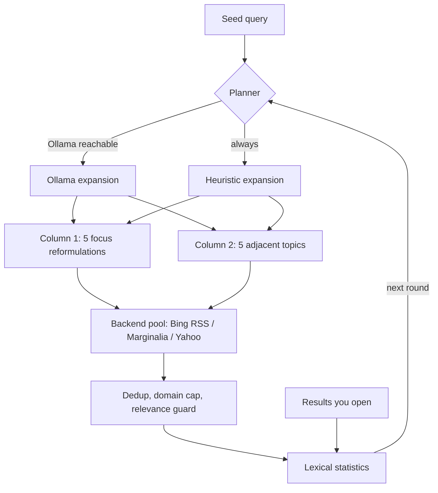

<div align="center">

# DendroPivot

### Pivot-based web search explorer: grow a tree of knowledge from one query

**An innovative methodology to learn deeper: start from one query, then pivot, branch and grow a tree of knowledge around it.**

DendroPivot turns a single search into a guided learning path. Every round, your seed query branches into five *focus* reformulations and five *adjacent* topics; what you read reinforces the tree, and any result can become the new root. It runs in the terminal or as a live local web tree, queries several free search indexes without an API key, can use a local LLM through [Ollama](https://ollama.com), and needs nothing but the Python standard library.

[](https://www.python.org/downloads/)
[](LICENSE)
[](requirements.txt)
[](#search-backends)
[](#ollama-integration)
[](#platform-support)
[](SECURITY.md)
[](CONTRIBUTING.md)

[](https://github.com/TFD-42/dendropivot-search/releases)
[](https://github.com/TFD-42/dendropivot-search/commits/main)
[](https://github.com/TFD-42/dendropivot-search/issues)
[](https://github.com/TFD-42/dendropivot-search/stargazers)

[English](README.md) · [Français](README.fr.md)

</div>

<p align="center">
  
</p>

<p align="center"><em>Live HTML tree: the seed at the root, focus reformulations (left) and adjacent topics (right), each card expanding to its results.</em></p>

---

## Table of contents

- [Why DendroPivot](#why-dendropivot)
- [The pivot methodology](#the-pivot-methodology)
- [Features](#features)
- [How it works](#how-it-works)
- [Requirements](#requirements)
- [Installation](#installation)
- [Launcher](#launcher)
- [Quick start](#quick-start)
- [Output modes](#output-modes)
- [Command-line options](#command-line-options)
- [Keyboard shortcuts](#keyboard-shortcuts)
- [Local web view](#local-web-view)
- [Remote server over SSH](#remote-server-over-ssh)
- [Ollama integration](#ollama-integration)
- [JSON output](#json-output)
- [Environment variables](#environment-variables)
- [Search backends](#search-backends)
- [Platform support](#platform-support)
- [Security model](#security-model)
- [Testing](#testing)
- [Project structure](#project-structure)
- [Contributing](#contributing)
- [License](#license)
- [Acknowledgements](#acknowledgements)

## Why DendroPivot

A single search query only shows one angle of a subject. DendroPivot (`websearch.py`) treats your query as a **seed**, fans it out into five reformulations and five adjacent topics, runs them against several free search indexes, and uses what you actually open to steer the next round. The result is an exploration tree rather than a flat list of ten blue links, available in the terminal, as JSON for pipelines, as a static HTML snapshot, or as a live local web page.

## The pivot methodology

Learning a subject in depth means moving between *what it is*, *how it is used*, *what it competes with*, *what changed recently* and *how it works inside*, then following the threads you did not know existed. DendroPivot makes that loop explicit:

| Step | What happens | Why it helps you learn |
|---|---|---|
| 1. **Seed** | You enter an initial query. | Sets the root of the tree. |
| 2. **Branch** | It fans out into 5 focus angles (definition, practical, comparison, recent, technical) and 5 adjacent topics. | Covers the subject from several perspectives instead of one ranking. |
| 3. **Read** | Opening a result reinforces its vocabulary in the lexical field. | Your curiosity steers the next round, not a generic ranking. |
| 4. **Grow** | Each new round anchors queries on the terms shared across results. | Surfaces the core concepts of the domain and its jargon. |
| 5. **Pivot** | Press `f` (or Shift + click) to make a result the new root. | Lets you dive into a sub-topic without losing context. |
| 6. **Backtrack** | History keeps every tree; `b` / `n` move back and forward. | Compare branches and return to the main trail at any time. |

The outcome is a map of a domain built from your own reading path, exportable as JSON or HTML.

## Features

- **Two columns per round**
  - **Focus**: the seed rephrased along five angles (definition, practical, comparison, recent, technical).
  - **Adjacent**: related topics derived from the lexical field of the results (bigrams, co-occurring terms) or proposed by a local model.
- **Continuous enrichment**: every result you open reinforces its terms and biases the next round; `f` pivots the seed onto the selected result.
- **Multi-backend search** with round-robin rotation, fallback, per-backend cooldown after failures, URL deduplication, per-domain caps and dictionary-noise filtering.
- **HTML first**: a plain run opens a live tree in your browser; outside a terminal it writes a self-contained HTML snapshot. Terminal UI (`--tui`), JSON (`--json`) and plain text (`--text`) remain available.
- **Launcher**: one menu to install Ollama and a model, choose the language, run a query or quit (`run.sh`, `run.bat`, `launcher.py`).
- **Six languages** (`--lang fr|en|es|it|zh|ru`): search templates, LLM expansion and interface; English and French interfaces work offline.
- **Navigation history**: every pivot or new seed archives the full state (results, views, lexical field); go back and forward like a browser.
- **Optional Ollama**: LLM query expansion and on-demand translation of the web UI and results (FR, EN, ES, IT, ZH, RU).
- **Python standard library only**: no `pip install`, runs anywhere Python 3.10+ runs, including Android through Termux.
- **Local-first security defaults**: loopback-only web server with Host and Origin checks (DNS rebinding and CSRF protection), strict CSP, bounded network reads and POST bodies, strict HTTP(S) URL validation, no shell invocation built from user input.

## How it works



Each round plans about ten queries, runs them with a politeness delay between HTTP requests, merges and filters the results, then waits for the next round (60 s by default).

## Requirements

| Component | Requirement |
|---|---|
| Python | **3.10 or newer** |
| Network | Outbound HTTPS to the search backends |
| Ollama | Optional, only for LLM expansion and translation |
| Python packages | None |

## Installation

```bash
git clone https://github.com/TFD-42/dendropivot-search.git
cd dendropivot-search
python3 -m py_compile websearch.py
```

No virtual environment or Python package is required. Ollama is optional; the [launcher](#launcher) installs it for you. On Termux:

```bash
pkg install python git
git clone https://github.com/TFD-42/dendropivot-search.git
cd dendropivot-search
```

### Prebuilt release packages

No `git` handy, or want dependencies prepared in one step? Each [release](https://github.com/TFD-42/dendropivot-search/releases/latest) ships three ready-to-run zips — same Python sources, no compiled binary, just a platform-appropriate setup script bundled in:

| Package | Contains | Run |
|---|---|---|
| `dendropivot-<version>-windows.zip` | `websearch.py`, `launcher.py`, `run.bat`, `setup.ps1` | `setup.ps1` then `run.bat` |
| `dendropivot-<version>-macos.zip` | `websearch.py`, `launcher.py`, `run.sh`, `setup.sh` | `./setup.sh` then `./run.sh` |
| `dendropivot-<version>-unix.zip` | `websearch.py`, `launcher.py`, `run.sh`, `setup.sh` | `./setup.sh` then `./run.sh` |

Unzip, then run the setup script once: it checks for Python 3.10+, installs/starts Ollama if it isn't already there, and pulls a model **only if none is installed yet** (same no-imposed-default behavior as the [launcher](#launcher) — safe to re-run, and the search still works without Ollama, using the built-in heuristic query expansion). The macOS and Unix/Linux zips are identical: `setup.sh` detects the OS (including Termux) at run time.

## Launcher

```bash
./run.sh              # Linux, macOS, Termux
run.bat               # Windows
python3 launcher.py   # any platform
```

```text
DendroPivot 1.1.0 · launcher
Language: English | Model: none (auto select) | Ollama: running (2 model(s))
1) Install / check dependencies
2) Select language
3) New query (HTML view)
4) Quit
```

| Choice | What it does |
|---|---|
| **1** | Checks Python 3.10+ and `websearch.py`; installs Ollama if missing (after confirmation); starts `ollama serve` if the local server is down; then [selects a model](#model-selection). Declining leaves a working heuristic-only setup. |
| **2** | Selects the search and interface language (auto, FR, EN, ES, IT, ZH, RU), saved for next time. |
| **3** | Asks for a query and opens the live HTML tree in the browser; if no model is selected yet, lists the installed ones first. Ctrl-C returns to the menu. |
| **4** | Quits. |

Ollama installation per platform (from the [official documentation](https://docs.ollama.com/linux)):

| Platform | Command run by choice 1 |
|---|---|
| Linux | `curl -fsSL https://ollama.com/install.sh \| sh` |
| Android (Termux) | `pkg install -y ollama` |
| macOS | `brew install ollama` if Homebrew is present, otherwise opens [ollama.com/download](https://ollama.com/download) |
| Windows | opens [ollama.com/download](https://ollama.com/download) for the `OllamaSetup.exe` installer |

### Model selection

No model is imposed.

| Ollama state | Behavior |
|---|---|
| Not installed or not reachable | No model; the search runs with heuristic expansion. |
| One model installed | Selected automatically. |
| Several models installed | Listed and picked by number (`Enter` keeps the saved one); `d` downloads another. |
| No model installed | The catalog below is offered; pick a number, type any exact Ollama tag, or `s` to skip. |

| Tag | Size | Note |
|---|---|---|
| [`qwen2.5:1.5b`](https://ollama.com/library/qwen2.5/tags) | 986 MB | Termux, low RAM |
| [`qwen2.5:3b`](https://ollama.com/library/qwen2.5:3b) | 1.9 GB | suggested: FR/EN/ES/IT/ZH/RU |
| [`qwen2.5:7b`](https://ollama.com/library/qwen2.5/tags) | 4.7 GB | better quality, 8 GB+ RAM or GPU |
| [`qwen2.5:14b`](https://ollama.com/library/qwen2.5/tags) | 9.0 GB | GPU |
| [`llama3.2:3b`](https://ollama.com/library/llama3.2) | 2.0 GB | no official ZH/RU support |

If a saved model is later removed from Ollama, the list is shown again. Without a launcher-selected model, `websearch.py` uses the first model Ollama lists.

Non-interactive use, for scripts and shortcuts:

```bash
./run.sh --check                 # exit code 0 when Python, the Ollama server and a model are ready
./run.sh --install --yes         # without the menu: saved model, else first installed, else downloads qwen2.5:3b
./run.sh --set-lang en           # remember the language
./run.sh --model llama3.2:3b     # remember another model
./run.sh -q "rust async runtime" # run a query directly
```

Settings live in `~/.config/dendropivot/settings.json` (Linux, Termux), `~/Library/Application Support/dendropivot/` (macOS) or `%APPDATA%\dendropivot\` (Windows); override with `TOK_CONFIG_DIR`. The Ollama server log is written next to it (`ollama-serve.log`).

## Quick start

Live HTML tree in the browser (default when run from a terminal):

```bash
python3 websearch.py -q "local LLM inference"
python3 websearch.py -q "modèles de langage" --lang fr
```

Single round as JSON, for scripts and pipelines:

```bash
python3 websearch.py \
  -q "local LLM inference" \
  --rounds 1 \
  --no-ollama \
  --json > results.json
```

Static HTML snapshot (default when not attached to a terminal; prints the file path):

```bash
python3 websearch.py -q "local LLM inference" --rounds 2 < /dev/null
python3 websearch.py -q "local LLM inference" --html-out results.html < /dev/null
```

Two-column terminal interface:

```bash
python3 websearch.py -q "local LLM inference" --tui
```

## Output modes

| Context | Default output | Override |
|---|---|---|
| Run from a terminal | Live HTML tree on `http://127.0.0.1:8765/`, opened in the browser, rounds until Ctrl-C | `--tui`, `--json`, `--text`, `--no-browser` |
| Pipe, cron, script (no TTY) | Self-contained HTML snapshot `dendropivot-<query>-<timestamp>.html` in the current directory, path printed on stdout | `--html-out PATH`, `--json`, `--text` |

If port 8765 is busy, a free port is chosen automatically and printed. Over SSH, the browser is not opened; the tunnel command is printed instead.

## Command-line options

| Option | Default | Description |
|---|---|---|
| `-q`, `--query TEXT` | prompt | Initial seed query |
| `-n`, `--limit N` | `6` | Maximum results per query (`>= 1`) |
| `--interval SECONDS` | `60` | Delay between rounds (`>= 1`) |
| `--delay SECONDS` | `1.5` | Delay between HTTP search requests (`>= 0`) |
| `--rounds N` | `0` | Number of rounds; `0` = unlimited in the web view and TUI, `1` for snapshot/JSON/text |
| `--lang CODE` | auto | `fr`, `en`, `es`, `it`, `zh`, `ru`: search templates, LLM expansion, interface and (with Ollama) result translation |
| `--no-ollama` | off | Heuristic expansion only |
| `--ollama-model NAME` | `$OLLAMA_MODEL` or first listed | Ollama model to use |
| `--no-color` | off | Disable ANSI colors (also honours `NO_COLOR`) |
| `--tui` | off | Two-column terminal interface instead of the HTML view |
| `--json` | off | JSON on stdout, then exit |
| `--text` | off | Plain text on stdout, then exit |
| `--log-file PATH` | `$WEBSEARCH_LOG` | Log file |
| `--web [PORT]` | `8765` | Web view port (automatic fallback if busy); with `--tui`, also serves the web view |
| `--web-host HOST` | `127.0.0.1` | Listening interface; only `127.0.0.1`, `localhost` or `::1` are accepted |
| `--no-browser` | off | Do not open the browser automatically |
| `--html-out PATH` | auto | Snapshot path; in web/TUI modes, rewritten after each round |
| `--no-web-ssh-hint` | off | Do not print SSH tunnel instructions |
| `--debug` | off | Debug logging |
| `--version` | | Print the version |

`--web-only` from v1.0 is still accepted as an alias of the default web mode. Run `python3 websearch.py --help` for the authoritative list.

## Keyboard shortcuts

Terminal interface (`--tui`):

| Key | Action |
|---|---|
| `↑` / `↓` or digits | Select a result |
| `←` / `→` or `Tab` | Switch column |
| `Enter` | Result details |
| `o` | Open in the default browser |
| `f` | Pivot: the selected result becomes the new seed |
| `b` / `n` | History back / forward |
| `r` | Run a round now |
| `p` | Pause / resume |
| `l` | Toggle the log |
| `w` | Open the web view (when enabled) |
| `q` | Back to the query prompt |
| `Ctrl-C` | Quit |

Terminals narrower than 90 columns (Termux portrait) stack the two columns vertically.

## Local web view

The default mode serves an auto-refreshing top-down tree: the seed at the top, the focus and adjacent groups, then one colored card per query that expands to its results. It also offers a full per-round history view, breadcrumb navigation, and an LLM translation selector.

| Action | Effect |
|---|---|
| Click a card | Expand or collapse it |
| Click a result | Open the link and mark it as viewed (steers the next round) |
| Shift + click a result | Pivot the seed onto that result |

<p align="center">
  
</p>

<p align="center"><em>Language selector: the interface and results are translated through the local LLM (English and French interfaces are built in).</em></p>

HTTP endpoints, all bound to loopback: `GET /`, `GET /state.json`, and `POST /api/{viewed,pivot,round,back,forward,goto,pause,seed,translate}` with JSON bodies.

## Remote server over SSH

The web server never listens on non-loopback interfaces. To use it from another machine, forward the port over SSH:

```bash
ssh -L 8765:127.0.0.1:8765 user@server
```

When `websearch.py` detects an SSH session (`SSH_CONNECTION`), it prints the exact tunnel command at startup and records it in the log (`l`).

## Ollama integration

If [Ollama](https://github.com/ollama/ollama) answers on `http://127.0.0.1:11434`, it is detected automatically and used for query expansion. Failures fall back to the heuristic expander, so a round always produces a plan.

```bash
python3 websearch.py -q "language models"
python3 websearch.py -q "language models" --ollama-model qwen2.5:3b
```

Use `--no-ollama` for deterministic runs without a local service. Translation in the web view still works on demand when Ollama is reachable, because `--no-ollama` only disables expansion.

## JSON output

```json
{
  "seed": "local LLM inference",
  "rounds": 1,
  "columns": {
    "1": [
      {
        "query": "local LLM inference",
        "method": "seed",
        "round": 1,
        "results": [
          { "title": "…", "url": "https://…", "snippet": "…", "backend": "bing-rss" }
        ]
      }
    ],
    "2": []
  },
  "lexical_field": ["…"]
}
```

## Environment variables

| Variable | Purpose |
|---|---|
| `OLLAMA_HOST` | Ollama base URL or `host:port` (default `http://127.0.0.1:11434`) |
| `OLLAMA_MODEL` | Preferred Ollama model |
| `WEBSEARCH_LOG` | Default log file path |
| `NO_COLOR` | Disable ANSI colors ([no-color.org](https://no-color.org/)) |
| `TOK_CONFIG_DIR` | Launcher settings directory |

## Search backends

| Backend | Endpoint | Notes |
|---|---|---|
| `bing-rss` | `bing.com/search?format=rss` | Structured RSS, default first choice for focus queries |
| `marginalia` | [`old-search.marginalia.nu`](https://old-search.marginalia.nu/) | Independent index; the anti-bot interstitial is followed automatically |
| `yahoo` | `search.yahoo.com` | Best-effort HTML parsing |

Backends rotate for adjacent queries to diversify indexes. A failing backend is put on a 180-second cooldown. HTML backends depend on third-party markup and can break without notice; please report it with the [bug template](.github/ISSUE_TEMPLATE/bug_report.yml).

Respect the terms of service of each search provider. The default politeness delay and round interval are there for that reason.

## Platform support

| Platform | Terminal UI | Open links |
|---|---|---|
| Linux | Yes | `xdg-open` |
| macOS | Yes | `open` |
| Windows (Windows Terminal, PowerShell, cmd) | Yes | `os.startfile` |
| Android via [Termux](https://termux.dev/) | Yes | `termux-open-url` |

## Security model

The built-in HTTP server is designed for **local, single-user use**:

- listens on loopback only (IPv4 or `::1`); non-local `--web-host` values are rejected;
- `Host` header must be a loopback name with the exact port (DNS rebinding protection);
- `POST` requires `Content-Type: application/json` and, when present, a same-origin `Origin` header (CSRF protection);
- `Content-Security-Policy` with `frame-ancestors 'none'`, `X-Frame-Options: DENY`, same-origin opener and resource policies;
- network responses capped at 5 MiB, JSON POST bodies at 64 KiB;
- seeds capped at 200 characters, history at 50 states;
- result URLs restricted to `http://` and `https://`;
- `X-Content-Type-Options: nosniff`, `Referrer-Policy: no-referrer`, `Cache-Control: no-store`;
- no `shell=True`, no shell command built from user input; the launcher only runs the fixed, displayed Ollama install command after explicit confirmation.

Do not expose it through a public reverse proxy without adding authentication, HTTPS and CSRF protection. See [SECURITY.md](SECURITY.md) to report a vulnerability privately.

## Testing

Tests run offline:

```bash
python3 -m unittest discover -s tests -v
python3 -m py_compile websearch.py launcher.py
./run.sh --check   # reproducible readiness check of the local Ollama setup
```

## Project structure

```text
dendropivot-search/
├── websearch.py              # application (HTML view, TUI, JSON, text)
├── launcher.py               # menu: install, language, query, quit
├── run.sh / run.bat          # launcher wrappers (POSIX / Windows)
├── tests/
│   ├── test_websearch.py     # offline unit tests
│   └── test_features_v11.py  # modes, languages, web hardening, launcher
├── docs/
│   ├── dendropivot-live-tree.png          # screenshot: live tree
│   └── dendropivot-language-selector.png  # screenshot: language selector
├── .github/
│   ├── ISSUE_TEMPLATE/       # bug, feature, config
│   ├── PULL_REQUEST_TEMPLATE.md
│   └── CODEOWNERS
├── README.md / README.fr.md
├── CHANGELOG.md
├── CONTRIBUTING.md
├── CODE_OF_CONDUCT.md
├── SECURITY.md
├── SUPPORT.md
├── CITATION.cff
├── LICENSE
└── requirements.txt          # intentionally empty: stdlib only
```

## Contributing

Contributions are welcome. Read [CONTRIBUTING.md](CONTRIBUTING.md) and the [Code of Conduct](CODE_OF_CONDUCT.md), then open an [issue](https://github.com/TFD-42/dendropivot-search/issues/new/choose) or a pull request. For help, see [SUPPORT.md](SUPPORT.md).

## License

Released under the [MIT License](LICENSE).

## Acknowledgements

- [Ollama](https://ollama.com) for local model serving.
- [Marginalia Search](https://old-search.marginalia.nu/) for an independent, non-commercial web index.
- [Shields.io](https://shields.io) for the badges.
- [Keep a Changelog](https://keepachangelog.com/en/1.1.0/) and [Semantic Versioning](https://semver.org/) for release conventions.

<div align="center">

Maintained by [@TFD-42](https://github.com/TFD-42) · [Report a bug](https://github.com/TFD-42/dendropivot-search/issues/new?template=bug_report.yml) · [Request a feature](https://github.com/TFD-42/dendropivot-search/issues/new?template=feature_request.yml)

</div>
