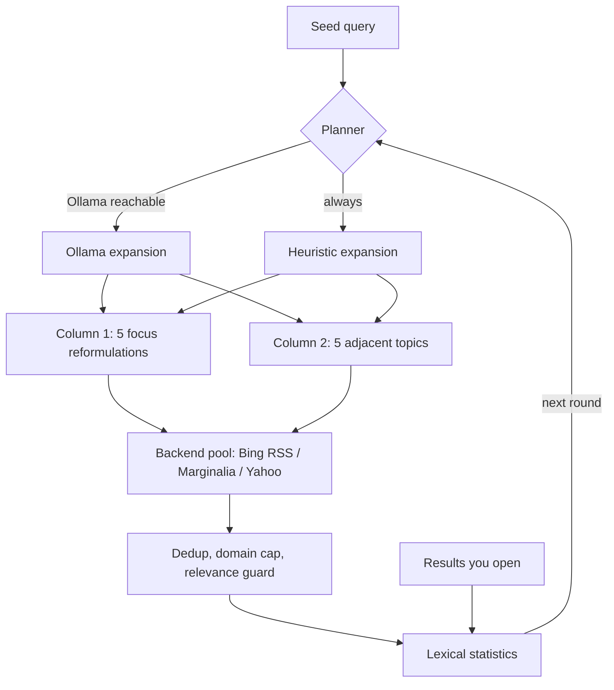

<div align="center">

# DendroPivot

**An innovative methodology to learn deeper: start from one query, then pivot, branch and grow a tree of knowledge around it.**

DendroPivot turns a single search into a guided learning path. Every round, your seed query branches into five *focus* reformulations and five *adjacent* topics; what you read reinforces the tree, and any result can become the new root. It runs in the terminal or as a live local web tree, queries several free search indexes without an API key, can use a local LLM through [Ollama](https://ollama.com), and needs nothing but the Python standard library.

[](https://www.python.org/downloads/)
[](LICENSE)
[](requirements.txt)
[](#search-backends)
[](#ollama-integration)
[](#platform-support)
[](SECURITY.md)
[](CONTRIBUTING.md)

[](https://github.com/TFD-42/dendropivot-search/releases)
[](https://github.com/TFD-42/dendropivot-search/commits/main)
[](https://github.com/TFD-42/dendropivot-search/issues)
[](https://github.com/TFD-42/dendropivot-search/stargazers)

[English](README.md) · [Français](README.fr.md)

</div>

---

## Table of contents

- [Why DendroPivot](#why-dendropivot)
- [The pivot methodology](#the-pivot-methodology)
- [Features](#features)
- [How it works](#how-it-works)
- [Requirements](#requirements)
- [Installation](#installation)
- [Quick start](#quick-start)
- [Command-line options](#command-line-options)
- [Keyboard shortcuts](#keyboard-shortcuts)
- [Local web view](#local-web-view)
- [Remote server over SSH](#remote-server-over-ssh)
- [Ollama integration](#ollama-integration)
- [JSON output](#json-output)
- [Environment variables](#environment-variables)
- [Search backends](#search-backends)
- [Platform support](#platform-support)
- [Security model](#security-model)
- [Testing](#testing)
- [Project structure](#project-structure)
- [Contributing](#contributing)
- [License](#license)
- [Acknowledgements](#acknowledgements)

## Why DendroPivot

A single search query only shows one angle of a subject. DendroPivot (`websearch.py`) treats your query as a **seed**, fans it out into five reformulations and five adjacent topics, runs them against several free search indexes, and uses what you actually open to steer the next round. The result is an exploration tree rather than a flat list of ten blue links, available in the terminal, as JSON for pipelines, as a static HTML snapshot, or as a live local web page.

## The pivot methodology

Learning a subject in depth means moving between *what it is*, *how it is used*, *what it competes with*, *what changed recently* and *how it works inside*, then following the threads you did not know existed. DendroPivot makes that loop explicit:

| Step | What happens | Why it helps you learn |
|---|---|---|
| 1. **Seed** | You enter an initial query. | Sets the root of the tree. |
| 2. **Branch** | It fans out into 5 focus angles (definition, practical, comparison, recent, technical) and 5 adjacent topics. | Covers the subject from several perspectives instead of one ranking. |
| 3. **Read** | Opening a result reinforces its vocabulary in the lexical field. | Your curiosity steers the next round, not a generic ranking. |
| 4. **Grow** | Each new round anchors queries on the terms shared across results. | Surfaces the core concepts of the domain and its jargon. |
| 5. **Pivot** | Press `f` (or Shift + click) to make a result the new root. | Lets you dive into a sub-topic without losing context. |
| 6. **Backtrack** | History keeps every tree; `b` / `n` move back and forward. | Compare branches and return to the main trail at any time. |

The outcome is a map of a domain built from your own reading path, exportable as JSON or HTML.

## Features

- **Two columns per round**
  - **Focus**: the seed rephrased along five angles (definition, practical, comparison, recent, technical).
  - **Adjacent**: related topics derived from the lexical field of the results (bigrams, co-occurring terms) or proposed by a local model.
- **Continuous enrichment**: every result you open reinforces its terms and biases the next round; `f` pivots the seed onto the selected result.
- **Multi-backend search** with round-robin rotation, fallback, per-backend cooldown after failures, URL deduplication, per-domain caps and dictionary-noise filtering.
- **Four output modes**: interactive TUI, JSON (`--json`), static HTML snapshot (`--html-out`), live local web view (`--web`, `--web-only`).
- **Navigation history**: every pivot or new seed archives the full state (results, views, lexical field); go back and forward like a browser.
- **Optional Ollama**: LLM query expansion and on-demand translation of the web UI and results (FR, EN, ES, IT, ZH, RU).
- **Python standard library only**: no `pip install`, runs anywhere Python 3.10+ runs, including Android through Termux.
- **Local-first security defaults**: loopback-only web server, bounded network reads and POST bodies, strict HTTP(S) URL validation, no shell invocation built from user input.

## How it works



Each round plans about ten queries, runs them with a politeness delay between HTTP requests, merges and filters the results, then waits for the next round (60 s by default).

## Requirements

| Component | Requirement |
|---|---|
| Python | **3.10 or newer** |
| Network | Outbound HTTPS to the search backends |
| Ollama | Optional, only for LLM expansion and translation |
| Python packages | None |

## Installation

```bash
git clone https://github.com/TFD-42/dendropivot-search.git
cd dendropivot-search
python3 -m py_compile websearch.py
```

No virtual environment or package installation is required. On Termux:

```bash
pkg install python git
git clone https://github.com/TFD-42/dendropivot-search.git
cd dendropivot-search
```

## Quick start

Interactive terminal session:

```bash
python3 websearch.py -q "local LLM inference" --no-ollama
```

Single round as JSON, for scripts and pipelines:

```bash
python3 websearch.py \
  -q "local LLM inference" \
  --rounds 1 \
  --no-ollama \
  --json > results.json
```

Static HTML snapshot:

```bash
python3 websearch.py \
  -q "local LLM inference" \
  --rounds 1 \
  --no-ollama \
  --html-out results.html
```

Live local web view without the TUI:

```bash
python3 websearch.py \
  -q "local LLM inference" \
  --web-only \
  --no-ollama
# open http://127.0.0.1:8765/
```

## Command-line options

| Option | Default | Description |
|---|---|---|
| `-q`, `--query TEXT` | prompt | Initial seed query |
| `-n`, `--limit N` | `6` | Maximum results per query (`>= 1`) |
| `--interval SECONDS` | `60` | Delay between rounds (`>= 1`) |
| `--delay SECONDS` | `1.5` | Delay between HTTP search requests (`>= 0`) |
| `--rounds N` | `0` | Number of rounds; `0` means unlimited in interactive mode, `1` when not attached to a TTY |
| `--no-ollama` | off | Heuristic expansion only |
| `--ollama-model NAME` | `$OLLAMA_MODEL` or first listed | Ollama model to use |
| `--no-color` | off | Disable ANSI colors (also honours `NO_COLOR`) |
| `--json` | off | JSON output in non-interactive mode |
| `--log-file PATH` | `$WEBSEARCH_LOG` | Log file |
| `--web [PORT]` | `8765` | Serve the live tree view on `http://127.0.0.1:PORT/` |
| `--web-host HOST` | `127.0.0.1` | Listening interface; only `127.0.0.1`, `localhost` or `::1` are accepted |
| `--web-only` | off | Web server and rounds without the TUI, until Ctrl-C (requires `-q`) |
| `--html-out PATH` | none | Rewrite a static HTML snapshot after each round |
| `--no-web-ssh-hint` | off | Do not print SSH tunnel instructions |
| `--debug` | off | Debug logging |

Run `python3 websearch.py --help` for the authoritative list.

## Keyboard shortcuts

| Key | Action |
|---|---|
| `↑` / `↓` or digits | Select a result |
| `←` / `→` or `Tab` | Switch column |
| `Enter` | Result details |
| `o` | Open in the default browser |
| `f` | Pivot: the selected result becomes the new seed |
| `b` / `n` | History back / forward |
| `r` | Run a round now |
| `p` | Pause / resume |
| `l` | Toggle the log |
| `w` | Open the web view (when enabled) |
| `q` | Back to the query prompt |
| `Ctrl-C` | Quit |

Terminals narrower than 90 columns (Termux portrait) stack the two columns vertically.

## Local web view

`--web` or `--web-only` serves an auto-refreshing top-down tree: the seed at the top, the focus and adjacent groups, then one colored card per query that expands to its results. It also offers a full per-round history view, breadcrumb navigation, and an LLM translation selector.

| Action | Effect |
|---|---|
| Click a card | Expand or collapse it |
| Click a result | Open the link and mark it as viewed (steers the next round) |
| Shift + click a result | Pivot the seed onto that result |

HTTP endpoints, all bound to loopback: `GET /`, `GET /state.json`, and `POST /api/{viewed,pivot,round,back,forward,goto,pause,seed,translate}` with JSON bodies.

## Remote server over SSH

The web server never listens on non-loopback interfaces. To use it from another machine, forward the port over SSH:

```bash
ssh -L 8765:127.0.0.1:8765 user@server
```

When `websearch.py` detects an SSH session (`SSH_CONNECTION`), it prints the exact tunnel command at startup and records it in the log (`l`).

## Ollama integration

If [Ollama](https://github.com/ollama/ollama) answers on `http://127.0.0.1:11434`, it is detected automatically and used for query expansion. Failures fall back to the heuristic expander, so a round always produces a plan.

```bash
python3 websearch.py -q "language models" --rounds 1
python3 websearch.py -q "language models" --ollama-model llama3.2
```

Use `--no-ollama` for deterministic runs without a local service. Translation in the web view still works on demand when Ollama is reachable, because `--no-ollama` only disables expansion.

## JSON output

```json
{
  "seed": "local LLM inference",
  "rounds": 1,
  "columns": {
    "1": [
      {
        "query": "local LLM inference",
        "method": "seed",
        "round": 1,
        "results": [
          { "title": "…", "url": "https://…", "snippet": "…", "backend": "bing-rss" }
        ]
      }
    ],
    "2": []
  },
  "lexical_field": ["…"]
}
```

## Environment variables

| Variable | Purpose |
|---|---|
| `OLLAMA_HOST` | Ollama base URL (default `http://127.0.0.1:11434`) |
| `OLLAMA_MODEL` | Preferred Ollama model |
| `WEBSEARCH_LOG` | Default log file path |
| `NO_COLOR` | Disable ANSI colors ([no-color.org](https://no-color.org/)) |

## Search backends

| Backend | Endpoint | Notes |
|---|---|---|
| `bing-rss` | `bing.com/search?format=rss` | Structured RSS, default first choice for focus queries |
| `marginalia` | [`old-search.marginalia.nu`](https://old-search.marginalia.nu/) | Independent index; the anti-bot interstitial is followed automatically |
| `yahoo` | `search.yahoo.com` | Best-effort HTML parsing |

Backends rotate for adjacent queries to diversify indexes. A failing backend is put on a 180-second cooldown. HTML backends depend on third-party markup and can break without notice; please report it with the [bug template](.github/ISSUE_TEMPLATE/bug_report.yml).

Respect the terms of service of each search provider. The default politeness delay and round interval are there for that reason.

## Platform support

| Platform | Terminal UI | Open links |
|---|---|---|
| Linux | Yes | `xdg-open` |
| macOS | Yes | `open` |
| Windows (Windows Terminal, PowerShell, cmd) | Yes | `os.startfile` |
| Android via [Termux](https://termux.dev/) | Yes | `termux-open-url` |

## Security model

The built-in HTTP server is designed for **local, single-user use**:

- listens on loopback only; non-local `--web-host` values are rejected;
- network responses capped at 5 MiB, JSON POST bodies at 64 KiB;
- seeds capped at 200 characters, history at 50 states;
- result URLs restricted to `http://` and `https://`;
- `X-Content-Type-Options: nosniff`, `Referrer-Policy: no-referrer`, `Cache-Control: no-store`;
- no `shell=True`, no shell command built from user input.

Do not expose it through a public reverse proxy without adding authentication, HTTPS and CSRF protection. See [SECURITY.md](SECURITY.md) to report a vulnerability privately.

## Testing

Tests run offline:

```bash
python3 -m unittest discover -s tests -v
python3 -m py_compile websearch.py
```

## Project structure

```text
dendropivot-search/
├── websearch.py              # single-file application
├── tests/
│   └── test_websearch.py     # offline unit tests
├── .github/
│   ├── ISSUE_TEMPLATE/       # bug, feature, config
│   ├── PULL_REQUEST_TEMPLATE.md
│   └── CODEOWNERS
├── README.md / README.fr.md
├── CHANGELOG.md
├── CONTRIBUTING.md
├── CODE_OF_CONDUCT.md
├── SECURITY.md
├── SUPPORT.md
├── CITATION.cff
├── LICENSE
└── requirements.txt          # intentionally empty: stdlib only
```

## Contributing

Contributions are welcome. Read [CONTRIBUTING.md](CONTRIBUTING.md) and the [Code of Conduct](CODE_OF_CONDUCT.md), then open an [issue](https://github.com/TFD-42/dendropivot-search/issues/new/choose) or a pull request. For help, see [SUPPORT.md](SUPPORT.md).

## License

Released under the [MIT License](LICENSE).

## Acknowledgements

- [Ollama](https://ollama.com) for local model serving.
- [Marginalia Search](https://old-search.marginalia.nu/) for an independent, non-commercial web index.
- [Shields.io](https://shields.io) for the badges.
- [Keep a Changelog](https://keepachangelog.com/en/1.1.0/) and [Semantic Versioning](https://semver.org/) for release conventions.

<div align="center">

Maintained by [@TFD-42](https://github.com/TFD-42) · [Report a bug](https://github.com/TFD-42/dendropivot-search/issues/new?template=bug_report.yml) · [Request a feature](https://github.com/TFD-42/dendropivot-search/issues/new?template=feature_request.yml)

</div>
